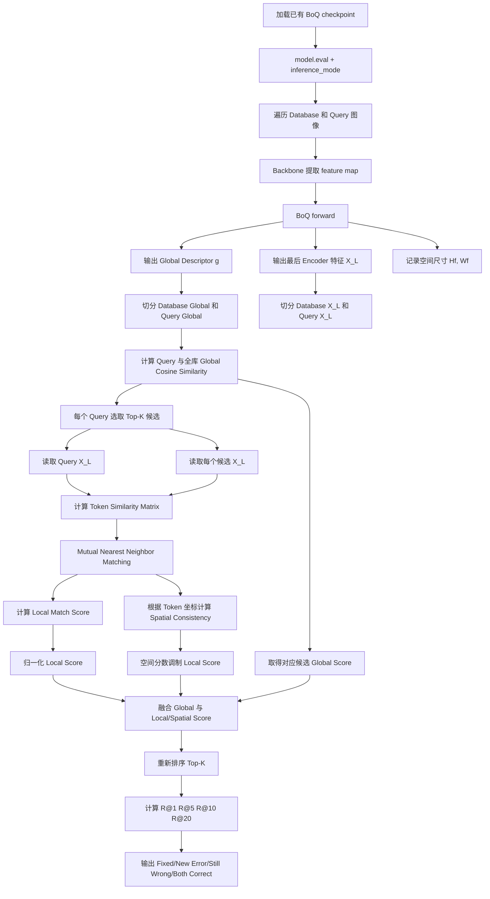
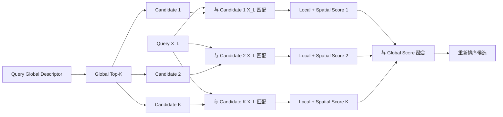

下面给你一份可以直接输入 Codex 的**实现规格说明**。目标是：

> 在不重新训练 BoQ 的前提下，使用已有 checkpoint，在推理阶段提取最后一个 Encoder 输出 XLX_LXL，对全局检索 Top-KKK 候选进行 mutual matching、空间一致性验证和重排序。

这正对应 BoQ 论文结论中提出的未来工作方向：利用最后一个 Encoder 输出 XLX_LXL 所保留的局部空间信息进行专门的 reranking。

------

# 一、整体目标

现有测试流程：

```
输入图像
→ Backbone
→ BoQ Aggregator
→ Global Descriptor
→ 全库相似度检索
→ Recall@K
```

修改后的测试流程：

```
输入图像
→ Backbone
→ BoQ Aggregator
   ├─ Global Descriptor
   └─ Last Encoder Tokens X_L
→ Global Descriptor 全库检索
→ 取 Top-K 候选
→ Query X_L 与候选 X_L 做局部匹配
→ 计算空间一致性
→ 融合 global/local/spatial score
→ Top-K 重排序
→ Recall@K
```

------

# 二、流程图

## 2.1 总体推理流程




------

## 2.2 单个 query 的重排序流程



------

# 三、论文变量与代码变量对应关系

| 论文符号       | 建议代码名                | 形状      | 含义                                  |
| -------------- | ------------------------- | --------- | ------------------------------------- |
| X0X_0X0        | `x`，进入 BoQ block 前    | `[B,N,C]` | backbone 特征投影和展平后的局部 token |
| XiX_iXi        | `x`，第 iii 个 encoder 后 | `[B,N,C]` | 第 iii 层编码后的局部 token           |
| XLX_LXL        | `x_last`                  | `[B,N,C]` | 最后一个 Encoder 输出                 |
| QiQ_iQi        | `queries`                 | `[B,M,C]` | learnable global queries              |
| OiO_iOi        | `block_output`            | `[B,M,C]` | query 从 XiX_iXi 中读取的结果         |
| ggg            | `global_descriptor`       | `[B,D]`   | 最终 BoQ 全局描述符                   |
| token 空间尺寸 | `spatial_shape`           | `(Hf,Wf)` | 用于恢复 token 二维位置               |

------

# 四、需要修改的代码模块

建议让 Codex 按下面的模块边界实现。

```
src/
├── models/
│   ├── aggregators/
│   │   └── boq.py
│   └── vpr_model.py
├── evaluation/
│   ├── feature_extraction.py
│   ├── global_retrieval.py
│   ├── xl_matching.py
│   ├── xl_reranking.py
│   └── metrics.py
└── scripts/
    └── evaluate_xl_reranking.py
```

现有项目目录不一致时，让 Codex适配真实路径，不要机械创建重复模块。

------

# 五、第一部分：修改 BoQ forward

## 5.1 修改目标

原始 `BoQ.forward()` 只返回 global descriptor。

需要增加可选参数：

```
return_local: bool = False
```

普通训练和原测试：

```
descriptor = model(images)
```

保持完全不变。

重排序测试：

```
outputs = model(images, return_local=True)
```

返回：

```
{
    "global": global_descriptor,
    "local": x_last,
    "spatial_shape": (height, width),
    "attention": last_attention,
}
```

------

## 5.2 精准实现要求

让 Codex 遵循：

```
def forward(
    self,
    x: torch.Tensor,
    return_local: bool = False,
):
    # x input: [B, C_in, Hf, Wf]

    x = self.proj_c(x)
    batch_size, channels, height, width = x.shape

    # [B,C,H,W] -> [B,N,C]
    x = x.flatten(2).permute(0, 2, 1)
    x = self.norm_input(x)

    block_outputs = []
    attentions = []

    for block in self.boqs:
        x, block_output, attention = block(x)
        block_outputs.append(block_output)
        attentions.append(attention)

    # 循环结束后的 x 即 X_L
    x_last = torch.nn.functional.normalize(
        x,
        p=2,
        dim=-1,
    )

    global_descriptor = torch.cat(
        block_outputs,
        dim=1,
    )
    global_descriptor = self.fc(
        global_descriptor.permute(0, 2, 1)
    )
    global_descriptor = global_descriptor.flatten(1)
    global_descriptor = torch.nn.functional.normalize(
        global_descriptor,
        p=2,
        dim=-1,
    )

    if return_local:
        return {
            "global": global_descriptor,
            "local": x_last,
            "spatial_shape": (height, width),
            "attention": attentions[-1],
        }

    return global_descriptor
```

## 5.3 兼容性要求

Codex 必须检查当前原代码返回值。

如果原来是：

```
return global_descriptor, attentions
```

则不能直接改成只返回 descriptor，应该保持：

```
if return_local:
    return {
        ...
    }

return global_descriptor, attentions
```

要求：

> 原始训练和原始测试调用方式、checkpoint 加载方式、全局描述符数值全部保持不变。

------

# 六、第二部分：整体 VPR 模型透传 `return_local`

模型外层一般是：

```
features = self.backbone(images)
descriptor = self.aggregator(features)
```

修改成：

```
def forward(
    self,
    images: torch.Tensor,
    return_local: bool = False,
):
    features = self.backbone(images)

    return self.aggregator(
        features,
        return_local=return_local,
    )
```

但如果 backbone 返回：

- list；
- dict；
- multi-level features；

Codex 必须遵循现有代码中原本选取 backbone feature 的逻辑，不能重新猜测。

------

# 七、第三部分：提取全局和局部特征

## 7.1 输入

测试 Dataset 当前返回：

```
image, index
```

并且图像排列是：

```
database images + query images
```

要求新建：

```
extract_boq_features(...)
```

输出结构：

```
@dataclass
class ExtractedFeatures:
    global_descriptors: torch.Tensor
    local_descriptors: torch.Tensor
    spatial_shape: tuple[int, int]
    indices: torch.Tensor
```

------

## 7.2 精准要求

```
@torch.inference_mode()
def extract_boq_features(
    model,
    dataloader,
    device,
    local_dtype=torch.float16,
):
    model.eval()

    globals_list = []
    locals_list = []
    indices_list = []

    spatial_shape = None

    for images, indices in dataloader:
        images = images.to(device, non_blocking=True)

        outputs = model(
            images,
            return_local=True,
        )

        global_desc = outputs["global"]
        local_desc = outputs["local"]
        current_shape = outputs["spatial_shape"]

        assert global_desc.ndim == 2
        assert local_desc.ndim == 3
        assert local_desc.shape[1] == (
            current_shape[0] * current_shape[1]
        )

        if spatial_shape is None:
            spatial_shape = current_shape
        else:
            assert spatial_shape == current_shape

        globals_list.append(
            global_desc.detach().cpu().float()
        )

        locals_list.append(
            local_desc.detach().cpu().to(local_dtype)
        )

        indices_list.append(
            indices.detach().cpu().long()
        )

    global_all = torch.cat(globals_list, dim=0)
    local_all = torch.cat(locals_list, dim=0)
    indices_all = torch.cat(indices_list, dim=0)

    order = torch.argsort(indices_all)

    return ExtractedFeatures(
        global_descriptors=global_all[order],
        local_descriptors=local_all[order],
        spatial_shape=spatial_shape,
        indices=indices_all[order],
    )
```

------

# 八、第四部分：切分 database/query

```
num_references = dataset.num_references

db_global = features.global_descriptors[:num_references]
q_global = features.global_descriptors[num_references:]

db_local = features.local_descriptors[:num_references]
q_local = features.local_descriptors[num_references:]
```

必须断言：

```
assert db_global.shape[0] == dataset.num_references
assert q_global.shape[0] == dataset.num_queries
assert db_local.shape[0] == dataset.num_references
assert q_local.shape[0] == dataset.num_queries
```

------

# 九、第五部分：全局检索

全局描述符已经 L2 归一化，所以直接计算：

Sglobal=GqGdbTS_{\mathrm{global}}=G_qG_{db}^{T}Sglobal=GqGdbT

代码要求：

```
def global_retrieval(
    query_global: torch.Tensor,
    database_global: torch.Tensor,
    top_k: int,
) -> tuple[torch.Tensor, torch.Tensor]:
    similarity = query_global @ database_global.T

    top_scores, top_indices = torch.topk(
        similarity,
        k=min(top_k, database_global.shape[0]),
        dim=1,
        largest=True,
        sorted=True,
    )

    return top_scores, top_indices
```

输出：

```
top_scores:  [num_queries, K]
top_indices: [num_queries, K]
```

------

# 十、第六部分：构造 token 空间坐标

XLX_LXL 为：

```
[N,C]
```

其中：

N=HfWfN=H_fW_fN=HfWf

需要构造归一化坐标：

```
def make_normalized_grid(
    height: int,
    width: int,
    device: torch.device,
) -> torch.Tensor:
    y, x = torch.meshgrid(
        torch.linspace(0, 1, height, device=device),
        torch.linspace(0, 1, width, device=device),
        indexing="ij",
    )

    return torch.stack(
        [x, y],
        dim=-1,
    ).reshape(-1, 2)
```

输出：

```
grid: [N,2]
```

每个 token 对应：

```
(x_normalized, y_normalized)
```

------

# 十一、第七部分：Mutual Nearest Matching

## 11.1 数学定义

对 query 和 candidate：

Xq∈RNq×CX_q\in\mathbb{R}^{N_q\times C}Xq∈RNq×CXr∈RNr×CX_r\in\mathbb{R}^{N_r\times C}Xr∈RNr×C

相似度矩阵：

S=XqXrTS=X_qX_r^TS=XqXrT

query token iii 的最佳 reference：

j∗(i)=arg⁡max⁡jSijj^*(i)=\arg\max_j S_{ij}j∗(i)=argjmaxSij

reference token jjj 的最佳 query：

i∗(j)=arg⁡max⁡iSiji^*(j)=\arg\max_i S_{ij}i∗(j)=argimaxSij

只有：

j=j∗(i)且i=i∗(j)j=j^*(i) \quad\text{且}\quad i=i^*(j)j=j∗(i)且i=i∗(j)

才保留。

------

## 11.2 返回结果

```
@dataclass
class MatchResult:
    matches: torch.Tensor
    match_scores: torch.Tensor
    quality: float
    coverage: float
    local_score: float
```

其中：

```
matches: [M,2]
```

每行：

```
[query_token_index, reference_token_index]
```

------

## 11.3 分数定义

匹配质量：

q=1M∑(i,j)∈MSijq= \frac{1}{M} \sum_{(i,j)\in\mathcal M}S_{ij}q=M1(i,j)∈M∑Sij

覆盖率：

c=Mmin⁡(Nq,Nr)c= \frac{M}{\min(N_q,N_r)}c=min(Nq,Nr)M

local score：

slocal=q⋅cs_{\mathrm{local}}=q\cdot cslocal=q⋅c

需要设置相似度阈值：

```
similarity_threshold=0.5
```

低于阈值的 mutual match 不保留。

------

# 十二、第八部分：空间一致性

第一版采用平移一致性诊断。

匹配对：

(i,j)∈M(i,j)\in\mathcal M(i,j)∈M

计算坐标位移：

Δij=pjr−piq\Delta_{ij}=p_j^r-p_i^qΔij=pjr−piq

如果是真实匹配，大部分位移应围绕某个主位移集中。

中心用中位数：

Δˉ=median⁡{Δij}\bar\Delta= \operatorname{median}\{\Delta_{ij}\}Δˉ=median{Δij}

残差：

eij=∥Δij−Δˉ∥2e_{ij} = \|\Delta_{ij}-\bar\Delta\|_2eij=∥Δij−Δˉ∥2

空间一致性：

sspatial=exp⁡(−median⁡(eij)2σ2)s_{\mathrm{spatial}} = \exp \left( -\frac{ \operatorname{median}(e_{ij})^2 }{ \sigma^2 } \right)sspatial=exp(−σ2median(eij)2)

参数：

```
sigma=0.15
min_matches=4
```

少于 `min_matches`：

```
spatial_score = 0.0
```

------

# 十三、第九部分：局部分数空间调制

不要直接把 spatial score 单独加到最终分数。

先用它调制 local score：

spair=slocal⋅[(1−λs)+λssspatial]s_{\mathrm{pair}} = s_{\mathrm{local}} \cdot \left[ (1-\lambda_s) + \lambda_s s_{\mathrm{spatial}} \right]spair=slocal⋅[(1−λs)+λssspatial]

推荐初值：

```
spatial_weight = 0.3
```

即：

```
pair_score = local_score * (
    0.7 + 0.3 * spatial_score
)
```

这样即使空间模型不适合某些大视角图像，也不会把 local score 直接压到零。

------

# 十四、第十部分：分数归一化和融合

global 和 local 分数分布不同，必须在每个 query 的 Top-K 内归一化。

```
def min_max_normalize(
    scores: torch.Tensor,
    eps: float = 1e-8,
) -> torch.Tensor:
    return (
        scores - scores.min()
    ) / (
        scores.max() - scores.min() + eps
    )
```

最终：

sfinal=αsglobalnorm+(1−α)spairnorms_{\mathrm{final}} = \alpha s_{\mathrm{global}}^{norm} + (1-\alpha)s_{\mathrm{pair}}^{norm}sfinal=αsglobalnorm+(1−α)spairnorm

推荐：

```
global_weight = 0.7
```

即：

```
final_score = (
    0.7 * global_score_norm
    + 0.3 * pair_score_norm
)
```

然后：

```
rerank_order = torch.argsort(
    final_score,
    descending=True,
)
```

------

# 十五、主程序完整流程

```
def main():
    # 1. 加载 Dataset/DataLoader
    dataset = build_test_dataset(...)
    dataloader = DataLoader(
        dataset,
        batch_size=32,
        shuffle=False,
        num_workers=8,
        pin_memory=True,
    )

    # 2. 加载已有 checkpoint
    model = load_model_from_checkpoint(...)
    model.eval()

    # 3. 提取 global + X_L
    features = extract_boq_features(
        model=model,
        dataloader=dataloader,
        device=device,
        local_dtype=torch.float16,
    )

    # 4. 切分 db/query
    num_refs = dataset.num_references

    db_global = features.global_descriptors[:num_refs]
    q_global = features.global_descriptors[num_refs:]

    db_local = features.local_descriptors[:num_refs]
    q_local = features.local_descriptors[num_refs:]

    # 5. 原始全局检索
    global_scores, global_indices = global_retrieval(
        query_global=q_global,
        database_global=db_global,
        top_k=50,
    )

    # 6. 计算 baseline Recall
    baseline_recall = compute_recall(
        predictions=global_indices,
        ground_truth=dataset.ground_truth,
    )

    # 7. 使用 X_L 重排序
    reranked_indices = rerank_all_queries(
        query_local=q_local,
        database_local=db_local,
        global_top_indices=global_indices,
        global_top_scores=global_scores,
        spatial_shape=features.spatial_shape,
        device=device,
        global_weight=0.7,
        similarity_threshold=0.5,
        spatial_sigma=0.15,
        spatial_weight=0.3,
    )

    # 8. 计算重排序 Recall
    reranked_recall = compute_recall(
        predictions=reranked_indices,
        ground_truth=dataset.ground_truth,
    )

    # 9. 错误迁移分析
    transition_stats = compute_transition_stats(
        baseline_predictions=global_indices,
        reranked_predictions=reranked_indices,
        ground_truth=dataset.ground_truth,
    )

    print(baseline_recall)
    print(reranked_recall)
    print(transition_stats)
```

------

# 十六、需要输出的实验结果

程序运行后必须输出：

```
Dataset:
Checkpoint:
Number of references:
Number of queries:
Top-K reranking:
Feature shape:
X_L token count:
X_L channel dimension:

Baseline:
R@1
R@5
R@10
R@20

Reranked:
R@1
R@5
R@10
R@20

Transition:
Fixed
New Error
Still Wrong
Both Correct
Net Gain

Timing:
Feature extraction time
Global retrieval time
Reranking time
Average reranking time per query
```

------

# 十七、配置参数

建议使用 dataclass 或 argparse。

```
@dataclass
class XLRerankConfig:
    top_k: int = 50
    global_weight: float = 0.7
    similarity_threshold: float = 0.5
    spatial_sigma: float = 0.15
    spatial_weight: float = 0.3
    min_matches: int = 4
    local_dtype: str = "float16"
    debug_num_queries: int | None = None
```

命令行示例：

```
python evaluate_xl_reranking.py \
  --checkpoint path/to/best.ckpt \
  --dataset pitts30k-test \
  --top-k 50 \
  --global-weight 0.7 \
  --similarity-threshold 0.5 \
  --spatial-sigma 0.15 \
  --spatial-weight 0.3
```

------

# 十八、Codex 必须执行的验证

## 18.1 全局描述符不变

修改前后的 global descriptor 必须一致：

```
torch.testing.assert_close(
    old_global_descriptor,
    new_output["global"],
    rtol=1e-5,
    atol=1e-6,
)
```

原始 Recall 也必须一致。

------

## 18.2 Shape 验证

```
assert global_desc.shape == (B, D)
assert local_desc.shape == (B, Hf * Wf, C)
assert grid.shape == (Hf * Wf, 2)
```

------

## 18.3 索引验证

```
assert global_indices.min() >= 0
assert global_indices.max() < dataset.num_references
```

ground truth 中的索引必须同样是 database local index。

------

## 18.4 单元测试

至少添加：

```
test_global_forward_unchanged
test_return_local_shape
test_normalized_grid_shape
test_mutual_matching_identity_case
test_mutual_matching_no_match_case
test_spatial_consistency_perfect_translation
test_recall_computation
test_reranking_preserves_candidate_set
```

其中：

```
set(reranked_indices[q].tolist()) == \
set(global_indices[q].tolist())
```

必须成立。

因为 reranking 只能重排，不能新增候选。

------

# 十九、第一阶段实验顺序

Codex 实现后不要直接只跑完整方法，要支持下面三种模式：

## 模式 1：Global only

```
BoQ Global
```

## 模式 2：Global + Mutual Matching

```
spatial_weight = 0
```

## 模式 3：Global + Mutual + Spatial

```
spatial_weight > 0
```

输出对比：

| 方法                      | R@1  | R@5  | R@10 | R@20 |
| ------------------------- | ---- | ---- | ---- | ---- |
| Global                    |      |      |      |      |
| Global + Mutual           |      |      |      |      |
| Global + Mutual + Spatial |      |      |      |      |

------

# 二十、直接给 Codex 的完整任务描述

你可以把下面整段直接复制给 Codex：

```
请在当前 Bag-of-Queries VPR 项目中实现一个 training-free X_L reranking 模块。

目标：
使用已有 BoQ checkpoint，不重新训练。在测试阶段同时提取原始 global descriptor 和最后一个 BoQ Encoder 输出 X_L。先使用 global descriptor 对数据库执行全局检索并召回 Top-K，然后利用 query X_L 和每个 Top-K candidate X_L 做 mutual nearest-neighbor token matching，计算局部匹配质量和空间一致性分数，融合 global/local score 后重新排序 Top-K，最后输出 reranking 前后的 Recall@1/5/10/20 和 Fixed/New Error/Still Wrong/Both Correct。

关键要求：

1. 修改 BoQ aggregator forward，新增 return_local=False 参数。
2. return_local=False 时必须保持现有训练和测试行为完全不变。
3. return_local=True 时返回：
   {
       "global": global_descriptor,
       "local": x_last,
       "spatial_shape": (Hf, Wf),
       "attention": last_attention
   }
4. x_last 必须是最后一次 BoQ block 循环结束后的 x，也就是论文中的 X_L，形状 [B, Hf*Wf, C]。
5. global descriptor 的计算路径不能改变，修改前后数值必须 torch.testing.assert_close。
6. 使用 model.eval() 和 torch.inference_mode()，不计算梯度，不更新参数。
7. 提取所有 database/query 的 global 和 X_L，并根据 dataset index 排序。
8. 按 dataset.num_references 切分 database 和 query。
9. global descriptor 已 L2 normalize，使用矩阵乘法计算 cosine similarity，取 Top-K。
10. 对每个 query 和 Top-K candidate：
    - 对 X_L token 做 L2 normalize；
    - 计算 token similarity matrix；
    - 保留 mutual nearest-neighbor matches；
    - 过滤 similarity < threshold 的匹配；
    - local quality = mean matched similarity；
    - coverage = num_matches / min(Nq, Nr)；
    - local_score = quality * coverage。
11. 根据 Hf,Wf 创建 [N,2] 的归一化 xy 坐标。
12. 对每个 mutual match 计算 displacement = ref_xy - query_xy。
13. 用 displacement median 作为主位移，用 residual median 计算：
    spatial_score = exp(-(median_residual^2)/(sigma^2))
14. 若匹配数少于 min_matches，则 spatial_score=0。
15. pair_score =
    local_score * ((1-spatial_weight) + spatial_weight*spatial_score)
16. 对每个 query 的 Top-K 内，分别对 global score 和 pair score 做 min-max normalize。
17. final_score =
    global_weight*global_norm + (1-global_weight)*pair_norm
18. 根据 final_score 对 Top-K 重新排序。
19. reranking 只能改变 Top-K 顺序，不能改变候选集合。
20. 输出：
    - baseline R@1/5/10/20
    - reranked R@1/5/10/20
    - Fixed
    - New Error
    - Still Wrong
    - Both Correct
    - Net Gain
    - feature extraction/global retrieval/reranking latency
21. 支持 argparse 参数：
    --top-k
    --global-weight
    --similarity-threshold
    --spatial-sigma
    --spatial-weight
    --min-matches
    --debug-num-queries
22. 添加单元测试：
    - global forward unchanged
    - return local shape
    - normalized grid
    - identity mutual matching
    - no-match case
    - perfect translation spatial consistency
    - reranking preserves candidate set
    - recall calculation
23. 第一版不要增加任何可训练层，不要修改 loss，不要重新训练。
24. 适配当前项目真实目录和现有 Lightning/model/dataset API，不要重复创建已有功能。
25. 先阅读项目现有 BoQ aggregator、model forward、test_step、predict_step、Recall 计算和 checkpoint 加载代码，再进行最小侵入式修改。

推荐默认参数：
top_k=50
global_weight=0.7
similarity_threshold=0.5
spatial_sigma=0.15
spatial_weight=0.3
min_matches=4

请先输出：
1. 当前项目相关文件定位；
2. 计划修改的文件；
3. 每个文件的修改点；
4. 再开始实现；
5. 实现后给出运行命令和测试命令。
```

------

# 二十一、你现在最需要强调给 Codex 的一句话

> **不要重写 BoQ，也不要改训练代码；只在推理阶段额外暴露最后一个 Encoder 输出 XLX_LXL，并在现有 global Top-K 检索结果上做候选内部重排序。**

第一版先验证：

Global→Global + Mutual→Global + Mutual + Spatial\text{Global} \rightarrow \text{Global + Mutual} \rightarrow \text{Global + Mutual + Spatial}Global→Global + Mutual→Global + Mutual + Spatial

这三组结果跑出来后，才能判断 XLX_LXL 本身是否真的具备重排序价值。