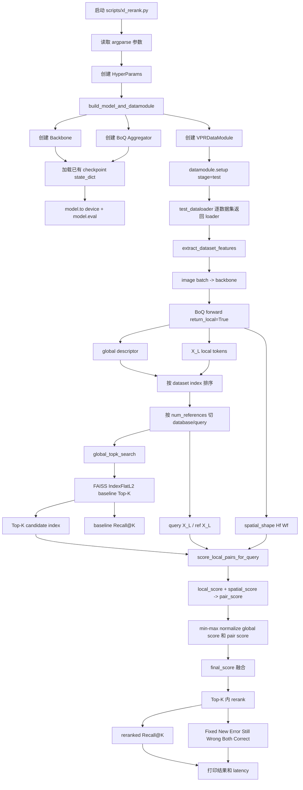
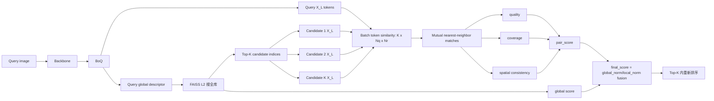

# B-reranking 实验说明：当前项目代码实现版

本文按照 `/home/code_qy_7_28/01_BoQ_inva_260716/B-reranking实验_260716.md` 的主体框架重新整理，但内容严格对齐当前项目真实代码、真实目录、真实输入输出和当前实现状态。

当前 reranking 是一个 **training-free test-time post-processing** 方法：

- 不重新训练 BoQ。
- 不修改 loss。
- 不更新 checkpoint 参数。
- 使用已有 BoQ checkpoint。
- 保持原项目 FAISS L2 baseline 逻辑。
- 在 baseline Top-K 候选内部使用 `X_L` 局部 token matching 重新排序。

当前核心文件：

```text
src/boq.py
src/xl_reranking.py
scripts/xl_rerank.py
tests/test_xl_reranking.py
scripts/reranking.sh
```

---

# 一、整体目标

## 1.1 原 BoQ 测试目标

原项目测试流程是：

```text
输入测试图片
-> DINOv2 / ResNet backbone
-> BoQ aggregator
-> global descriptor
-> FAISS IndexFlatL2 检索
-> Recall@1/5/10/20
```

原 BoQ 只使用最终全局描述子：

```text
global descriptor: [B, D]
默认 D = 8192
```

这个全局描述子适合快速全库检索，但它把整张图压成一个向量，局部空间信息被高度压缩。

## 1.2 当前 reranking 目标

当前 reranking 的目标是：

```text
先用原 BoQ global descriptor 找 Top-K 候选；
再使用 BoQ 最后一个 encoder 输出 X_L 做局部 token 匹配；
计算 local matching 分数和 spatial consistency 分数；
融合 global/local 后只在 Top-K 内重新排序；
输出 reranking 前后的 Recall 和错误迁移统计。
```

修改后的测试流程：

```text
输入测试图片
-> Backbone
-> BoQ Aggregator
   ├─ global descriptor: [B, D]
   └─ X_L local tokens: [B, Hf*Wf, C]
-> global descriptor 用 FAISS L2 全库检索
-> 取每个 query 的 Top-K 候选
-> query X_L 与 Top-K candidate X_L 做 mutual nearest-neighbor token matching
-> 计算 local_score、spatial_score、pair_score
-> 每个 query 的 Top-K 内 min-max normalize
-> final_score 融合
-> Top-K 内重排序
-> 输出 Baseline / Reranked Recall 和 Fixed/New Error/Still Wrong/Both Correct
```

当前默认参数：

```text
top_k = 50
global_weight = 0.7
similarity_threshold = 0.5
spatial_sigma = 0.15
spatial_weight = 0.3
min_matches = 4
rerank_device = cuda:0
```

---

# 二、流程图

## 2.1 当前完整推理流程



## 2.2 单个 query 的重排序流程



---

# 三、论文变量与当前代码变量对应关系

| 论文 / 概念 | 当前代码名 | 所在文件 | 形状 | 含义 |
| --- | --- | --- | --- | --- |
| 输入图片 | `images` | `scripts/xl_rerank.py` | `[B, 3, H, W]` | 测试 batch 图片 |
| Backbone 输出 | `model.backbone(images)` | `scripts/xl_rerank.py` | `[B, C_in, Hf, Wf]` | DINOv2 / ResNet 特征图 |
| BoQ 输入 token | `x` | `src/boq.py` | `[B, Hf*Wf, C]` | 经过 `proj_c` 和 flatten 后的图像 token |
| 最后 encoder 输出 | `x_last` / `local` | `src/boq.py` | `[B, Hf*Wf, C]` | 当前 reranking 使用的 `X_L` |
| Learnable queries | `self.queries` | `src/boq.py` | `[1, num_queries, C]` | BoQ 查询槽位 |
| Query cross-attention 输出 | `out` | `src/boq.py` | `[B, num_queries, C]` | BoQ block 读取出的聚合 token |
| 全局描述子 | `global` / `out` | `src/boq.py` | `[B, output_dim]` | 原 BoQ 用于全局检索的 descriptor |
| 空间尺寸 | `spatial_shape` | `src/boq.py` | `(Hf, Wf)` | 将 token index 映射回二维坐标 |
| Top-K 候选 | `baseline_indices` | `src/xl_reranking.py` | `[num_queries, K]` | FAISS L2 baseline 检索结果 |
| 局部匹配分数 | `pair_scores` | `src/xl_reranking.py` | `[num_queries, K]` | X_L matching + spatial 调制后的候选分数 |
| 重排后候选 | `reranked_indices` | `src/xl_reranking.py` | `[num_queries, K]` | Top-K 内重新排序后的结果 |

当前默认 DINOv2 测试输入：

```text
image: [3, 322, 322]
patch_size = 14
Hf = 23
Wf = 23
N = 23 * 23 = 529
C = 512 after BoQ channel projection
X_L: [B, 529, 512]
global descriptor: [B, 8192]
```

---

# 四、当前代码模块

## 4.1 已修改 / 新增模块

```text
src/boq.py
  BoQ aggregator
  新增 forward(return_local=False)

src/xl_reranking.py
  reranking 核心算法
  FAISS L2 baseline
  token matching
  spatial consistency
  score fusion
  Recall 和 transition stats

scripts/xl_rerank.py
  命令行入口
  构建模型和 datamodule
  加载 checkpoint
  提取 global 和 X_L
  调用 reranking

tests/test_xl_reranking.py
  单元测试

scripts/reranking.sh
  当前实验命令脚本
```

## 4.2 与原项目模块的关系

原项目仍然保留：

```text
train.py
src/model.py
src/utils.py
src/dataloaders/datamodule.py
src/dataloaders/test_datasets.py
```

reranking 没有替代原项目测试逻辑，而是在测试阶段额外读取 BoQ 中间输出：

```text
原测试:
  BoQModel.test_step -> collect global descriptor -> utils.compute_recall_performance

reranking:
  scripts/xl_rerank.py -> extract global + X_L -> FAISS baseline -> X_L rerank
```

---

# 五、第一部分：修改 BoQ forward

## 5.1 修改目标

当前 `src/boq.py` 中 `BoQ.forward()` 已支持：

```python
def forward(self, x, return_local=False):
```

默认：

```text
return_local=False
```

保持原训练和原测试行为：

```python
return out, attns
```

reranking 使用：

```python
features = model.aggregator(model.backbone(images), return_local=True)
```

返回：

```python
{
    "global": out,
    "local": x_last,
    "spatial_shape": (Hf, Wf),
    "attention": attns[-1] if attns else None,
}
```

## 5.2 当前真实代码逻辑

当前位置：`src/boq.py`

```python
x = self.proj_c(x)
Hf, Wf = x.shape[-2:]
x = x.flatten(2).permute(0, 2, 1)
x = self.norm_input(x)

outs = []
attns = []
for i in range(len(self.boqs)):
    x, out, attn = self.boqs[i](x)
    outs.append(out)
    attns.append(attn)

x_last = x
out = torch.cat(outs, dim=1)
out = self.fc(out.permute(0, 2, 1))
out = out.flatten(1)
out = torch.nn.functional.normalize(out, p=2, dim=-1)
```

数据形状变化：

```text
backbone feature map:
  [B, C_in, Hf, Wf]

proj_c 后:
  [B, 512, Hf, Wf]

flatten 后:
  [B, Hf*Wf, 512]

最后一个 BoQBlock 后:
  x_last = [B, Hf*Wf, 512]

global descriptor:
  [B, output_dim]
  默认 [B, 8192]
```

## 5.3 兼容性要求和当前状态

当前已经满足：

```text
return_local=False 时返回格式不变
global descriptor 计算路径不变
训练和原始测试不会主动调用 return_local=True
```

当前仍建议后续补齐：

```text
1. local = x_last 可改成 F.normalize(x_last, p=2, dim=-1)
2. BoQModel.forward 可透传 return_local
```

原因：

```text
当前 matching 内部会 normalize X_L，所以结果不受明显影响；
但文档接口上，return_local=True 返回 normalized local 更规范。
```

---

# 六、第二部分：整体 VPR 模型透传 return_local

## 6.1 当前状态

当前 `src/model.py` 的 `BoQModel.forward()` 仍是原始形式：

```python
def forward(self, x):
    x = self.backbone(x)
    x, attns = self.aggregator(x)
    return x, attns
```

这意味着：

```python
model(images, return_local=True)
```

当前不能直接使用。

## 6.2 当前脚本如何绕过

当前 `scripts/xl_rerank.py` 直接调用：

```python
features = model.aggregator(model.backbone(images), return_local=True)
```

这样功能上可以拿到：

```text
global descriptor
X_L local tokens
spatial_shape
attention
```

但接口上没有完全封装到 `BoQModel.forward()`。

## 6.3 下一步建议

建议后续改成：

```python
def forward(self, x, return_local=False):
    x = self.backbone(x)
    return self.aggregator(x, return_local=return_local)
```

但要小心保持原调用兼容：

```text
training_step 仍能写 descriptors, attentions = self(images)
validation/test 仍能写 descriptors, _ = self(images)
```

目的：

```text
让外部脚本不需要手动拆 model.backbone 和 model.aggregator；
使模型 API 和文档一致。
```

---

# 七、第三部分：提取全局和局部特征

## 7.1 输入

测试 dataset 返回：

```python
image, index
```

当前测试集构建在：

```text
src/dataloaders/datamodule.py
src/dataloaders/test_datasets.py
```

测试图像排列约定：

```text
database images first
query images second
```

每个 dataset 有：

```text
dataset.num_references
dataset.num_queries
dataset.ground_truth
```

## 7.2 当前提取函数

当前函数在 `scripts/xl_rerank.py`：

```python
def extract_dataset_features(model, dataloader, device):
```

核心逻辑：

```python
with torch.inference_mode():
    for images, indices in dataloader:
        images = images.to(device, non_blocking=True)
        features = model.aggregator(model.backbone(images), return_local=True)
        global_chunks.append(features["global"].detach().cpu())
        local_chunks.append(features["local"].detach().cpu())
        index_chunks.append(indices.detach().cpu())
```

输出 dict：

```python
{
    "global": torch.cat(global_chunks)[order].float(),
    "local": torch.cat(local_chunks)[order].float(),
    "indices": indices[order],
    "spatial_shape": spatial_shape,
    "attention_shape": attention_shape,
}
```

## 7.3 当前输入输出形状

以 DINOv2 为例：

```text
images:
  [B, 3, 322, 322]

features["global"]:
  [B, 8192]

features["local"]:
  [B, 529, 512]

features["spatial_shape"]:
  (23, 23)
```

排序逻辑：

```python
indices = torch.cat(index_chunks, dim=0)
order = indices.argsort()
```

作用：

```text
确保最终 features 顺序严格按 dataset index 排列；
也就是 database 在前，query 在后。
```

## 7.4 当前主要问题

当前函数会缓存整个数据集的 `local`：

```text
所有 database X_L
所有 query X_L
```

对小数据集可行。

对大数据集如 Tokyo247：

```text
database = 75984
query = 315
每张 X_L 约 1.08 MB
全量 database X_L 约 82 GB
```

会导致：

```text
Killed
```

即 Linux OOM killer 杀掉进程。

---

# 八、第四部分：切分 database/query

当前切分位置：`scripts/xl_rerank.py`

```python
num_references = dataset.num_references
ref_global = features["global"][:num_references]
query_global = features["global"][num_references:]
ref_local = features["local"][:num_references]
query_local = features["local"][num_references:]
```

当前已加入断言：

```python
assert ref_global.shape[0] == dataset.num_references
assert query_global.shape[0] == dataset.num_queries
assert ref_local.shape[0] == dataset.num_references
assert query_local.shape[0] == dataset.num_queries
```

意义：

```text
防止 feature 顺序错乱；
防止 database/query 切分错误；
防止后续 Recall 计算使用错误索引。
```

注意：

```text
reranking 只能在 database index 空间内操作。
dataset.ground_truth 里的正样本 index 也必须是 database index。
```

---

# 九、第五部分：全局检索

## 9.1 原项目标准

原项目 baseline 使用：

```python
faiss.IndexFlatL2
```

当前 reranking baseline 已严格对齐原项目：

```python
def global_topk_search(query_global, ref_global, top_k):
    index = faiss.IndexFlatL2(ref_np.shape[1])
    index.add(ref_np)
    distances, indices = index.search(query_np, k)
```

返回：

```text
baseline_scores: [num_queries, K]
baseline_indices: [num_queries, K]
```

其中：

```text
baseline_indices 是 FAISS L2 从 database 中搜出的 Top-K index。
```

## 9.2 为什么不是 torch cosine

如果 descriptor L2 normalize，则：

```text
L2 distance^2 = 2 - 2 * cosine_similarity
```

理论上：

```text
L2 越小 <=> cosine 越大
```

但为了严格和原项目一致，当前 baseline 直接使用 FAISS L2。

并且完整模式下会校验：

```python
utils.compute_recall_performance(...)
```

如果 reranking baseline Recall 和原项目 Recall 不一致，会报错。

## 9.3 score 的处理

FAISS L2 distance 是：

```text
越小越好
```

但后续 fusion 希望：

```text
越大越好
```

所以当前使用：

```python
scores = -distances
```

这样：

```text
distance 越小 -> score 越大
```

---

# 十、第六部分：构造 token 空间坐标

当前函数：

```python
normalized_xy_grid(spatial_shape)
```

输入：

```text
spatial_shape = (Hf, Wf)
```

输出：

```text
grid: [Hf*Wf, 2]
```

每一行：

```text
[x_normalized, y_normalized]
```

例如：

```text
Hf = 23
Wf = 23
N = 529
grid = [529, 2]
```

用途：

```text
将 token index 转成二维空间位置；
后续计算 displacement = ref_xy - query_xy。
```

为什么要归一化到 `[0, 1]`：

```text
让空间距离不依赖原图像像素大小；
不同特征图尺寸下 spatial_sigma 仍有可比性。
```

---

# 十一、第七部分：Mutual Nearest Matching

## 11.1 数学定义

对一个 query 和一个 candidate：

```text
Xq: [Nq, C]
Xr: [Nr, C]
```

先对 token 做 L2 normalize：

```text
q_i = normalize(q_i)
r_j = normalize(r_j)
```

计算相似度矩阵：

```text
S = Xq Xr^T
S[i, j] = query token i 与 reference token j 的 cosine similarity
```

query token 的最近 reference：

```text
j*(i) = argmax_j S[i, j]
```

reference token 的最近 query：

```text
i*(j) = argmax_i S[i, j]
```

保留条件：

```text
j = j*(i)
且
i = i*(j)
```

也就是：

```text
query token A 最像 reference token B；
reference token B 反过来也最像 query token A。
```

## 11.2 当前单 pair 代码

当前单 pair 函数：

```python
mutual_nearest_neighbor_matches(query_local, ref_local, similarity_threshold)
```

核心代码：

```python
query_tokens = F.normalize(query_local, p=2, dim=-1)
ref_tokens = F.normalize(ref_local, p=2, dim=-1)
sim = query_tokens @ ref_tokens.transpose(0, 1)

q_to_r = sim.argmax(dim=1)
r_to_q = sim.argmax(dim=0)
q_indices = torch.arange(sim.shape[0], device=sim.device)
is_mutual = r_to_q[q_to_r] == q_indices
```

再过滤：

```python
keep = matched_sim >= similarity_threshold
```

默认：

```text
similarity_threshold = 0.5
```

## 11.3 当前批量 Top-K 代码

为了加速，当前使用：

```python
score_local_pairs_for_query(query_local, candidate_locals, ...)
```

输入：

```text
query_local: [N, C]
candidate_locals: [K, N, C]
```

一次性计算：

```python
sim = torch.einsum("qc,krc->kqr", query_tokens, candidate_tokens)
```

输出：

```text
sim: [K, Nq, Nr]
```

含义：

```text
一个 query 同时对 Top-K 个 candidate 做 token similarity。
```

这样把原来的：

```text
50 次小矩阵乘法
```

变成：

```text
1 次 batched GPU 计算
```

公式不变，只是计算组织方式变快。

## 11.4 分数定义

匹配质量：

```text
quality = mean(matched_similarities)
```

覆盖率：

```text
coverage = num_matches / min(Nq, Nr)
```

局部分数：

```text
local_score = quality * coverage
```

白话：

```text
匹配不仅要像，还要匹配得多。
```

---

# 十二、第八部分：空间一致性

空间一致性用于判断：

```text
这些 token 匹配在图像空间上是否合理。
```

对每个 mutual match：

```text
query token index i -> query_xy
reference token index j -> ref_xy
```

计算位移：

```text
displacement = ref_xy - query_xy
```

如果是同一地点，很多匹配的位移应围绕一个主位移集中。

当前代码：

```python
main_displacement = displacement.median(dim=0).values
residual = torch.linalg.norm(displacement - main_displacement, dim=1)
median_residual = residual.median()
spatial_score = exp(-(median_residual ** 2) / sigma ** 2)
```

默认：

```text
spatial_sigma = 0.15
min_matches = 4
```

如果：

```text
num_matches < min_matches
```

则：

```text
spatial_score = 0
```

原因：

```text
匹配太少时，空间一致性没有统计意义。
```

---

# 十三、第九部分：局部分数空间调制

当前不把 spatial_score 直接加到最终分数。

错误理解：

```text
final_score = global_score + local_score + spatial_score
```

当前真实实现：

```text
pair_score = local_score * ((1 - spatial_weight) + spatial_weight * spatial_score)
```

默认：

```text
spatial_weight = 0.3
```

所以：

```text
pair_score = local_score * (0.7 + 0.3 * spatial_score)
```

含义：

```text
local_score 是局部证据强度；
spatial_score 是局部证据可信度；
pair_score 是被空间一致性调制后的局部证据。
```

为什么这么做：

```text
spatial_score 本身不代表两张图是不是同一个地点；
它只表示已经匹配上的 token 位移是否一致。
```

如果直接把 spatial_score 加入最终分数，可能出现：

```text
local 匹配很少，但 spatial_score 偶然很高
导致错误候选被抬高
```

所以 spatial 只调制 local，不单独作为最终证据。

---

# 十四、第十部分：分数归一化和融合

对每个 query 的 Top-K 候选，有两类分数：

```text
baseline_scores:
  来自 FAISS L2 distance 的负数，越大越好

pair_scores:
  来自 X_L local matching + spatial consistency
```

两类分数尺度不同，所以当前做 Top-K 内 min-max normalize：

```python
global_norm = minmax_normalize(baseline_scores)
pair_norm = minmax_normalize(pair_scores)
```

最终融合：

```python
final_scores = global_weight * global_norm + (1 - global_weight) * pair_norm
```

默认：

```text
global_weight = 0.7
```

即：

```text
final_score = 0.7 * global_norm + 0.3 * pair_norm
```

为什么保留 global：

```text
X_L local matching 不是独立训练的局部匹配模型；
它容易受重复纹理、遮挡、大视角变化影响；
global descriptor 仍然是最稳定的主证据。
```

最后重排：

```python
rerank_order = final_scores.argsort(dim=1, descending=True)
reranked_indices = baseline_indices.gather(1, rerank_order)
```

关键约束：

```text
reranking 只能改变 Top-K 顺序；
不能引入 Top-K 之外的新候选。
```

---

# 十五、主程序完整流程

当前主程序：`scripts/xl_rerank.py`

## 15.1 参数解析

主要参数：

```text
--checkpoint
--datasets
--top-k
--global-weight
--similarity-threshold
--spatial-sigma
--spatial-weight
--min-matches
--debug-num-queries
--rerank-device
```

## 15.2 构建模型和数据

```python
hparams = HyperParams()
select_test_sets(hparams, args.datasets)
model, datamodule = build_model_and_datamodule(hparams)
load_checkpoint(model, args.checkpoint)
model.to(device)
model.eval()
datamodule.setup(stage="test")
```

`build_model_and_datamodule()` 来自：

```text
scripts/test_checkpoints_in_dir.py
```

它复用当前项目真实模型构建逻辑。

## 15.3 每个数据集循环

```python
for dataloader in datamodule.test_dataloader():
    dataset = dataloader.dataset
    features, extraction_seconds = extract_dataset_features(...)
    ref_global / query_global / ref_local / query_local = split
    original_baseline_recalls = utils.compute_recall_performance(...)
    result = rerank_topk(...)
    assert baseline matches original
    print metrics
```

## 15.4 当前运行命令

单数据集：

```bash
/root/miniconda3/envs/BoQ/bin/python scripts/xl_rerank.py \
  --checkpoint '/home/code_qy_7_28/00_Baseline_BoQ_260711/logs/dinov2_vitb14/version_16/checkpoints/archive-epoch[17].ckpt' \
  --datasets amstertime \
  --top-k 50 \
  --global-weight 0.7 \
  --similarity-threshold 0.5 \
  --spatial-sigma 0.15 \
  --spatial-weight 0.3 \
  --min-matches 4 \
  --rerank-device cuda:0
```

所有数据集：

```bash
/root/miniconda3/envs/BoQ/bin/python scripts/xl_rerank.py \
  --checkpoint '/home/code_qy_7_28/00_Baseline_BoQ_260711/logs/dinov2_vitb14/version_16/checkpoints/archive-epoch[17].ckpt' \
  --top-k 50 \
  --global-weight 0.7 \
  --similarity-threshold 0.5 \
  --spatial-sigma 0.15 \
  --spatial-weight 0.3 \
  --min-matches 4 \
  --rerank-device cuda:0
```

注意：

```text
当前所有数据集直接跑会在大 database 数据集上 OOM，例如 Tokyo247。
```

---

# 十六、需要输出的实验结果

当前脚本输出：

```text
Checkpoint:
Device:
Rerank params:

[dataset_name] extracting global descriptors and X_L ...
Baseline verification:
Spatial shape:
Baseline:
Reranked:
Top-1 transitions:
Latency:
```

示例：

```text
Baseline: R@1: 63.85  R@5: 82.70  R@10: 86.68  R@20: 89.93
Reranked: R@1: 64.58  R@5: 84.08  R@10: 88.87  R@20: 91.80
Top-1 transitions: Fixed=49  New Error=40  Still Wrong=396  Both Correct=746  Net Gain=9
Latency: feature_extraction=26.005s  global_retrieval=0.864s  reranking=699.024s
```

各字段含义：

```text
Baseline:
  原项目 FAISS L2 baseline 结果

Reranked:
  Top-K 内经过 X_L reranking 后的结果

Fixed:
  baseline Top-1 错，reranked Top-1 对

New Error:
  baseline Top-1 对，reranked Top-1 错

Still Wrong:
  baseline 和 reranked 都错

Both Correct:
  baseline 和 reranked 都对

Net Gain:
  Fixed - New Error
```

当前建议补充输出：

```text
Number of references
Number of queries
Top-K
X_L token count
X_L channel dimension
Total time
Average reranking time per query
```

---

# 十七、配置参数

当前配置 dataclass：

```python
@dataclass(frozen=True)
class RerankConfig:
    top_k: int = 50
    global_weight: float = 0.7
    similarity_threshold: float = 0.5
    spatial_sigma: float = 0.15
    spatial_weight: float = 0.3
    min_matches: int = 4
    debug_num_queries: int | None = None
    rerank_device: str | None = None
```

参数解释：

```text
top_k:
  第一阶段 FAISS baseline 召回多少候选。
  必须 >= 20，否则不能和原项目 R@20 对齐。

global_weight:
  最终融合里 global_norm 的权重。
  默认 0.7，即 global 为主，local 辅助。

similarity_threshold:
  mutual token match 的最低 cosine similarity。
  默认 0.5。

spatial_sigma:
  空间 residual 的指数衰减尺度。
  越小，空间不一致惩罚越强。

spatial_weight:
  spatial_score 对 local_score 的调制强度。
  默认 0.3。

min_matches:
  少于该匹配数时 spatial_score = 0。

debug_num_queries:
  只对前 N 个 query 做 reranking，用于估时。
  注意：当前仍会提取完整 dataset 的 X_L。

rerank_device:
  X_L token matching 使用的设备。
  建议 cuda:0。
```

当前 argparse 对应：

```text
--top-k
--global-weight
--similarity-threshold
--spatial-sigma
--spatial-weight
--min-matches
--debug-num-queries
--rerank-device
```

---

# 十八、必须执行的验证

## 18.1 全局描述符不变

当前测试：

```python
test_global_forward_unchanged
```

验证：

```text
BoQ.forward(x)[0]
和
BoQ.forward(x, return_local=True)["global"]
数值一致
```

作用：

```text
确保新增 return_local 不改变原 global descriptor。
```

## 18.2 baseline 和原项目一致

当前测试：

```python
test_faiss_l2_baseline_matches_original_recall
```

验证：

```text
reranking 的 global_topk_search
和
src/utils.py 的 compute_recall_performance
使用相同 FAISS L2 语义。
```

完整脚本运行时也会校验：

```text
Baseline verification: matches original project FAISS L2 Recall@K
```

如果不一致，会报错。

## 18.3 Shape 验证

当前测试：

```python
test_return_local_shape
test_normalized_grid
```

验证：

```text
global: [B, D]
local: [B, Hf*Wf, C]
spatial_shape: (Hf, Wf)
grid: [Hf*Wf, 2]
```

## 18.4 Mutual matching 验证

当前测试：

```python
test_identity_mutual_matching
test_no_match_case
```

验证：

```text
完全相同 token 应该互相匹配
完全负相关 / 阈值不满足时应该无匹配
```

## 18.5 空间一致性验证

当前测试：

```python
test_perfect_translation_spatial_consistency
```

验证：

```text
完美平移匹配时 spatial_score 接近 1。
```

## 18.6 reranking 不改变候选集合

当前测试：

```python
test_reranking_preserves_candidate_set
```

验证：

```python
set(reranked_indices[q]) == set(baseline_indices[q])
```

## 18.7 向量化实现不改变分数

当前测试：

```python
test_vectorized_pair_scores_match_scalar_scores
```

验证：

```text
新 GPU batched Top-K scoring
和
旧逐 pair scalar scoring
数值一致。
```

---

# 十九、第一阶段实验顺序

当前建议按三种模式做实验，不要只看完整 reranking。

## 模式 1：Global only

含义：

```text
只看原 BoQ FAISS L2 baseline。
```

当前脚本中：

```text
Baseline 行就是 Global only。
```

输出：

```text
Baseline: R@1/R@5/R@10/R@20
```

用途：

```text
作为绝对基线；
所有 reranking 的收益都必须和它比。
```

## 模式 2：Global + Mutual Matching

含义：

```text
使用 X_L mutual matching，但关闭 spatial 调制。
```

运行方式：

```bash
--spatial-weight 0
```

此时：

```text
pair_score = local_score
```

用途：

```text
判断局部 token matching 本身是否有效。
```

## 模式 3：Global + Mutual + Spatial

含义：

```text
使用 X_L mutual matching，并用 spatial_score 调制 local_score。
```

运行方式：

```bash
--spatial-weight 0.3
```

当前默认就是该模式。

用途：

```text
判断空间一致性能否减少误匹配、提升 Net Gain。
```

## 19.4 推荐记录表

建议记录：

| Dataset | 方法 | R@1 | R@5 | R@10 | R@20 | Fixed | New Error | Net Gain | Feature Time | Rerank Time |
| --- | --- | ---: | ---: | ---: | ---: | ---: | ---: | ---: | ---: | ---: |
| amstertime | Global |  |  |  |  | - | - | - |  |  |
| amstertime | Global + Mutual |  |  |  |  |  |  |  |  |  |
| amstertime | Global + Mutual + Spatial |  |  |  |  |  |  |  |  |  |

## 19.5 当前最重要的下一步改进

当前最大工程问题：

```text
extract_dataset_features 会缓存全量 database/query X_L。
```

这会导致大 database 数据集 OOM，例如 Tokyo247：

```text
database = 75984
query = 315
全量 database X_L 约 82 GB
```

下一步应改成：

```text
1. 第一阶段只提取全量 global descriptor。
2. 用 FAISS L2 得到每个 query 的 Top-K candidate index。
3. 第二阶段只按需提取 query X_L 和 Top-K candidate X_L。
4. 分 query batch / candidate batch 做 GPU reranking。
5. 用完释放，不缓存全量 database X_L。
```

为什么这么改：

```text
reranking 实际只需要 Top-K candidate 的 X_L；
没有必要保存整个 database 的 X_L。
```

例如 Tokyo247：

```text
错误做法：
  保存 75984 张 database X_L

合理做法：
  query = 315
  top_k = 50
  最多处理 315 * 50 个候选对
  并且可以分批处理，用完释放
```

这是保证精度前提下最关键的速度和内存优化方向。

